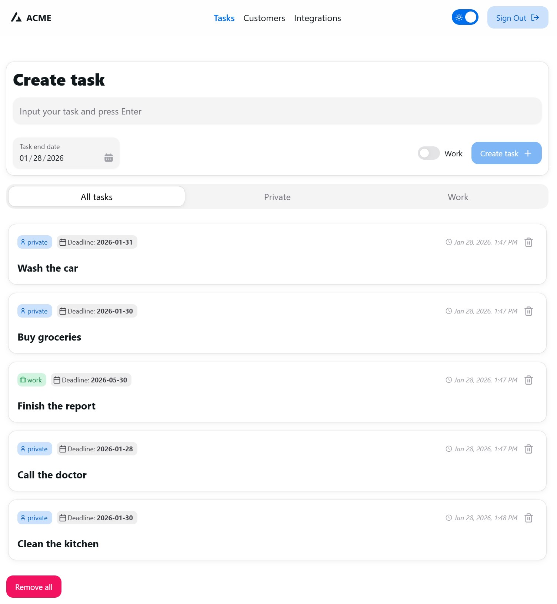
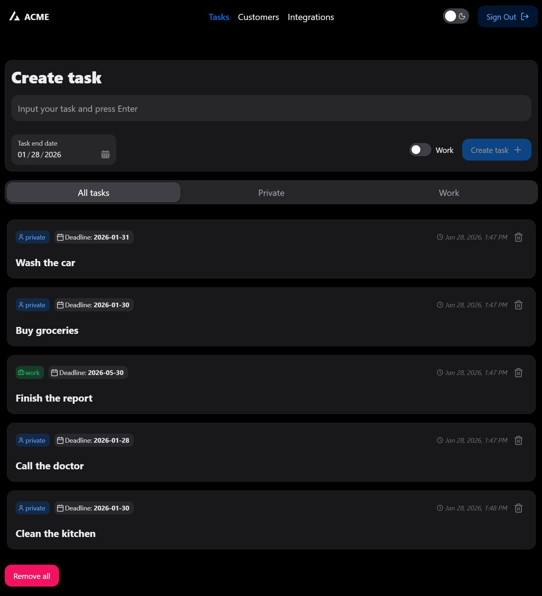
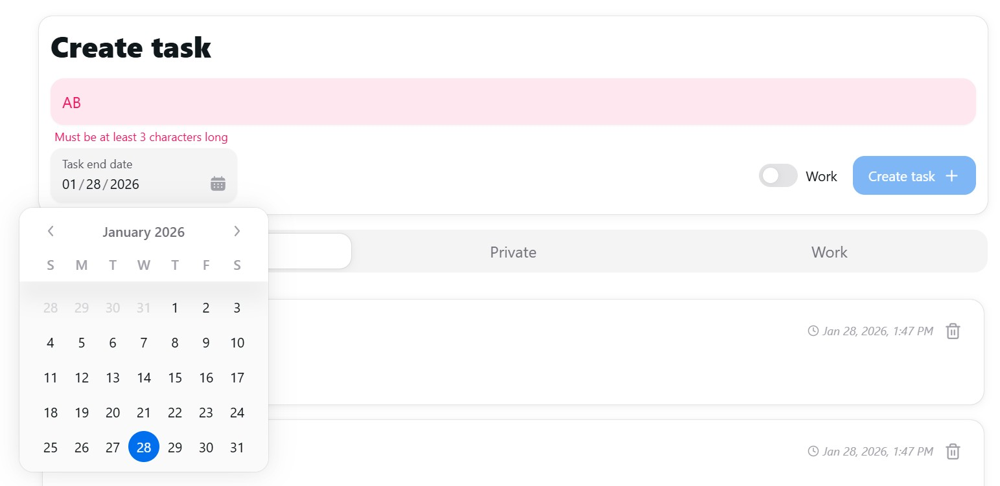

# React + TypeScript + Vite – Keycloak, RTK, RTK Query, Routing, Testing (Vitest)

<p align="center">
  
  
  
  
  
  
  
  
  
  
</p>

A modern learning sandbox and portfolio-ready starter: React 19 + TypeScript + Vite, Keycloak (OIDC) auth via react-oidc-context, state with Redux Toolkit, data layer with RTK Query, routing (React Router 7), and testing (Vitest + Testing Library + MSW).


## Table of Contents
- Features
- Tech Stack
- Quick Start
- Keycloak Setup (Docker)
- Mock API: JSON Server
- Routing
- State & RTK Query
- Testing (Vitest, RTL, MSW)
- Project Structure
- Screenshots
- Roadmap (Priorities)
- npm Scripts
- Troubleshooting
- What are those rectangular badges?
- License


## Features
- Keycloak (OIDC) login and protected routes (ProtectedRoute)
- Per-user notes/tasks list (filtered by author email)
- Add/delete tasks with form validation (React Hook Form + Zod)
- Theme switching, UI with HeroUI + Tailwind 4
- Routes: Tasks, Profile, Login
- Unit/integration tests with Vitest + Testing Library + MSW


## Tech Stack
- Build/runtime: Vite 7, TypeScript 5
- UI: React 19, HeroUI, TailwindCSS 4, next-themes
- State: Redux Toolkit, RTK Query
- Auth: Keycloak via react-oidc-context (authorization code flow)
- Routing: React Router 7
- Mock API: JSON Server (db/db.json)
- Testing: Vitest, @testing-library/react, @testing-library/jest-dom, MSW


## Quick Start
Requirements: Node 18+ (LTS), Docker Desktop.

```bash
# 1) Install dependencies
npm install

# 2) Start Keycloak (Docker)
npm run keycloak:up
# Keycloak UI: http://127.0.0.1:8080

# 3) Start the mock API (JSON Server)
npm run server
# API: http://localhost:3001

# 4) Start the app (Vite)
npm run dev
# UI: http://127.0.0.1:5173
```

Note: minimal Keycloak configuration is required on your side (realm, client, and test users). See the next section.

Default OIDC config (see `src/main.tsx`):
- authority: `http://127.0.0.1:8080/realms/my-dev-realm`
- client_id: `react-app`
- redirect_uri: `http://127.0.0.1:5173`


## Keycloak Setup (Docker)
1) Open Keycloak: `http://127.0.0.1:8080`. Admin / password: `admin` / `admin` (from docker-compose).  
2) Create Realm: `my-dev-realm`.  
3) Create Client: `react-app` (Public).  
   - Valid redirect URIs: `http://127.0.0.1:5173/*`  
   - Web origins: `*` (development only; tighten for prod)  
4) Create a few test users (e.g., `test@test.com`).

Minimal user-side configuration required: make sure the realm, client and users exist and match the values used in `src/main.tsx`.

On successful login, the app cleans OIDC params from URL and navigates to `/tasks`.


## Mock API: JSON Server
- DB file: `db/db.json`
- Port: `3001`
- Collection: `notes`

Examples:
- GET `http://localhost:3001/notes?author=test@test.com` – fetch notes for a given author
- POST `http://localhost:3001/notes` – create note `{ title, author }`
- DELETE `http://localhost:3001/notes/:id` – delete one note

Note: JSON Server is a mock – no backend-side authorization checks. Filtering by author happens client-side or via query params.


## Routing
- `/login` – login screen (OIDC)
- `/tasks` – tasks list (protected)
- `/profile` – user profile (protected)

Visiting `/` redirects to `/tasks`. Protection via `ProtectedRoute` + `react-oidc-context` state.


## State & RTK Query
- Store: `src/store/store.ts`
- API slice: `src/features/notes/notesApi.ts`

Hooks:
- `useGetNotesQuery(authorEmail)` – fetch notes for the user
- `useAddNoteMutation()` – add a note and invalidate list
- `useDeleteNoteMutation()` – delete a note


## Testing (Vitest, RTL, MSW)
- Runner: Vitest (JSDOM)
- UI testing: @testing-library/react + @testing-library/jest-dom
- Network mocks: MSW

Run:
```bash
npm test
# or with a verbose reporter & watch
npx vitest --reporter=verbose --watch
```

Tips:
- If you encounter `ResizeObserver is not defined` in tests, add a simple polyfill in `setupTests.ts`.
- Use MSW handlers that mirror JSON Server responses for `/notes`.


## Project Structure (excerpt)
```
src/
  components/
    TasksComponent.tsx
    ProfileComponent.tsx
    ProtectedRoute.tsx
    router.tsx
  features/
    notes/
      notesApi.ts
      notesApi.test.tsx
  store/
    store.ts
public/
  vite.svg
  screenshots/   # put README images here
```


## Screenshots
Place your images in `public/screenshots/` and update the links below.








## Roadmap (Priorities)
1) UI/integration tests (Tasks, Profile) with MSW; edge cases (empty, error, loading).  
2) Refine auth flow (clean session properly, switch users reliably).  
3) Form validations with RHF + Zod (create/edit task), user-friendly error messages.  
4) Routing expansion: task details `/tasks/:id`, 404, lazy-loading routes.  
5) RTK Query cache hygiene (tags, invalidation, optimistic updates).  
6) Refactors: split components, test custom hooks, improve DX.  
7) Optional: deployment (Netlify/Vercel) + hosted Keycloak or bundled Docker Compose; production docs.


## npm Scripts
- `npm run dev` – start Vite (dev)
- `npm run build` – production build
- `npm run preview` – preview the build
- `npm run server` – start JSON Server (`db/db.json`) on port 3001
- `npm run keycloak:up` / `down` / `logs` – control Keycloak via Docker Compose
- `npm test` – run Vitest

## License
MIT
